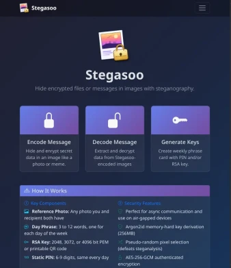
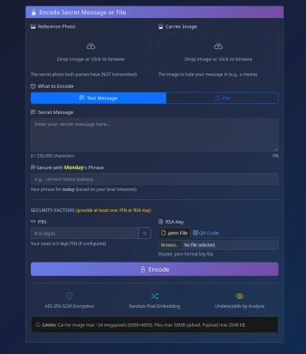
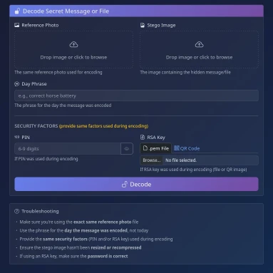

# Stegasoo

A secure steganography system for hiding encrypted messages in images using hybrid authentication.

[](https://github.com/adlee-was-taken/stegasoo/actions/workflows/test.yml)
[](https://github.com/adlee-was-taken/stegasoo/actions/workflows/lint.yml)

[](LICENSE)


## Features

- **AES-256-GCM** authenticated encryption
- **Argon2id** memory-hard key derivation (256MB RAM requirement)
- **Pseudo-random pixel selection** defeats steganalysis
- **Multi-factor authentication**: Reference photo + passphrase + PIN/RSA key
- **Multiple interfaces**: CLI, Web UI, REST API
- **File embedding**: Hide any file type (PDF, ZIP, documents)
- **DCT steganography**: JPEG-resilient embedding for social media
- **Channel keys**: Private group communication channels

## Embedding Modes

| Mode | Capacity (1080p) | JPEG Resilient | Best For |
|------|------------------|----------------|----------|
| **DCT** (default) | ~150 KB | Yes | Social media, messaging apps |
| **LSB** | ~750 KB | No | Email, direct file transfer |

## Web UI

| Home | Encode | Decode | Generate |
|:----:|:------:|:------:|:--------:|
|  |  |  |  |

## Quick Start

```bash
# Install (Python 3.10-3.12)
pip install -e ".[all]"

# Generate credentials
stegasoo generate --pin --words 4

# Encode a message
stegasoo encode \
  --ref my_photo.jpg \
  --carrier meme.jpg \
  --passphrase "apple forest thunder mountain" \
  --pin 123456 \
  --message "Secret message"

# Decode
stegasoo decode \
  --ref my_photo.jpg \
  --stego stego_image.png \
  --passphrase "apple forest thunder mountain" \
  --pin 123456
```

## Interfaces

| Interface | Start Command | Documentation |
|-----------|---------------|---------------|
| **CLI** | `stegasoo --help` | [CLI.md](CLI.md) |
| **Web UI** | `cd frontends/web && python app.py` | [WEB_UI.md](WEB_UI.md) |
| **REST API** | `cd frontends/api && uvicorn main:app` | [API.md](API.md) |

## Security Model

```
Reference Photo ──┐
(~80-256 bits)    │
                  ├──► Argon2id KDF ──► AES-256-GCM Key
Passphrase ───────┤    (256MB RAM)
(~43-132 bits)    │
                  │
PIN ──────────────┤
(~20-30 bits)     │
                  │
RSA Key ──────────┘
(optional)
```

| Configuration | Entropy | Use Case |
|--------------|---------|----------|
| 4-word passphrase + 6-digit PIN | ~153 bits | Standard security |
| 4-word passphrase + PIN + RSA | ~280+ bits | Maximum security |

## Requirements

| Requirement | Version |
|-------------|---------|
| Python | 3.10-3.12 |
| RAM | 512 MB+ |

## Development

```bash
pip install -e ".[dev]"
pytest
black src/ tests/ frontends/
ruff check src/ tests/ frontends/
```

## Docker

```bash
# Quick start (HTTPS enabled by default)
docker-compose up -d

# Access
# Web UI:   https://localhost:5000  (self-signed cert)
# REST API: http://localhost:8000

# Disable HTTPS if needed:
STEGASOO_HTTPS_ENABLED=false docker-compose up -d
```

See [DOCKER.md](DOCKER.md) for full documentation.

## Raspberry Pi

Pre-built SD card images available for Pi 4/5:

```bash
# Flash image (download from GitHub Releases)
zstdcat stegasoo-rpi-*.img.zst | sudo dd of=/dev/sdX bs=4M status=progress

# First boot runs interactive setup wizard:
# - WiFi configuration
# - HTTPS with port 443
# - Channel key generation
# - Optional overclocking
```

See [rpi/README.md](rpi/README.md) for manual installation.

## Documentation

- [INSTALL.md](INSTALL.md) - Installation guide
- [DOCKER.md](DOCKER.md) - Docker deployment
- [CLI.md](CLI.md) - Command-line reference
- [API.md](API.md) - REST API documentation
- [WEB_UI.md](WEB_UI.md) - Web interface guide
- [SECURITY.md](SECURITY.md) - Security model details
- [UNDER_THE_HOOD.md](UNDER_THE_HOOD.md) - Technical deep-dive
- [CHANGELOG.md](CHANGELOG.md) - Version history
- [CONTRIBUTING.md](CONTRIBUTING.md) - Contributor guide
- `man stegasoo` - Man page (install: `sudo cp docs/stegasoo.1 /usr/local/share/man/man1/ && sudo mandb`)

## License

MIT License - see [LICENSE](LICENSE). Use responsibly.

---

*This tool is for educational and legitimate privacy purposes. Users are responsible for complying with applicable laws.*
